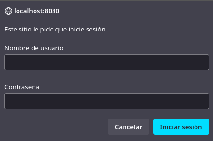
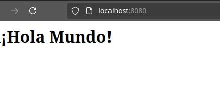
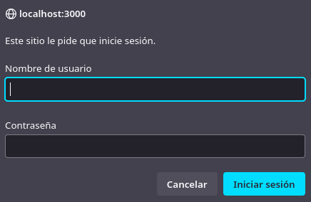
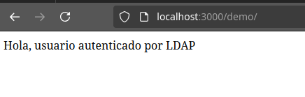

# Práctica 6-3. Servidor web con usuarios autenticados mediante servicio de directorio (LDAP)

Para esta práctica, utilizaremos 'docker-compose' para crear una 
aplicación web con usuarios autenticados mediante LDAP. 

En mi caso, crearé toda la estructura de archivos y directorios 
sobre el directorio "Home" de mi usuario.

## Despliegue con Nginx, OpenLDAP y daemon de autenticación LDAP

En primer lugar crearemos los directorios y archivos que compondrán 
el proyecto. En mi caso, ejecuto:

```console
cd 
mkdir -p practica6-3/app
mkdir practica6-3/conf
touch practica6-3/app/index.html
touch practica6-3/conf/ldap_nginx.conf
```

Con un editor de texto agregamos el contenido de los archivos 'index.html' 
y 'ldap_nginx.conf'. El contenido de 'index.html' será uno sencillo:

```html
<html>
	<body>
		<h1>¡Hola Mundo!</h1>
	</body>
</html>
```

El contenido de 'ldap_nginx.conf' será:

```nginx
server {
      listen 8080;

      location = / {
         auth_request /auth-proxy;
      }

      location = /auth-proxy {
         internal;

         proxy_pass http://nginx-ldap:8888;
         proxy_set_header X-Ldap-URL "ldap://openldap:1389";
         proxy_set_header X-Ldap-BaseDN "dc=example,dc=org";
         proxy_set_header X-Ldap-BindDN "cn=admin,dc=example,dc=org";
         proxy_set_header X-Ldap-BindPass "adminpassword";
      }
   }
```

Y por último crearemos el archivo 'docker-compose.yml' 
(practica6-3/docker-compose.yml) con el siguiente contenido: 

```yaml
version: '2'

services:
  nginx-ldap:  # 
    image: bitnami/nginx-ldap-auth-daemon-archived # 
    ports: # 
      - 8888:8888
  nginx: # 
    image: bitnami/nginx
    ports: 
     - 8080:8080
    volumes: # 
     - ./app:/app
     - ./conf/ldap_nginx.conf:/opt/bitnami/nginx/conf/server_blocks/ldap_nginx.conf
  openldap: # 
    image: bitnami/openldap
    ports:
      - '1389:1389'    
    environment: # 
      - LDAP_ADMIN_USERNAME=admin
      - LDAP_ADMIN_PASSWORD=adminpassword
      - LDAP_USERS=customuser
      - LDAP_PASSWORDS=custompassword
```

Y ya sólo queda ejecutar:

```console
docker compose up
```

Si accedemos al puerto '8080' de la IP de la máquina donde hayamos creado la 
aplicación a través del navegador, se nos pedirá que nos autentifiquemos: 



Una vez introducimos los datos de autenticación, se nos permitirá acceder 
a la página:



## Despliegue con PHP y Apache con LDAP

Para esta segunda parte de la práctica, he borrado todos los archivos y 
directorios dentro de '~/practica6-3', ya que será este mismo directorio 
en el que realice el despliegue con PHP y Apache. Antes de eliminar los 
archivos, he detenido la ejecución de los contenedores creados en el 
anterior apartado con:

```console
docker compose down
```

Ahora, con los contenedores detenidos y el directorio limpio, vamos a 
comenzar creando un 'index.php'. También tendrá un contenido muy simple:

```php
<?php
echo "Hola, usuario autenticado por LDAP";
?>
```

También crearemos un directorio 'Docker' y, dentro de él, un archivo Dockerfile 
con el siguiente contenido:

```dockerfile
FROM php:7-apache
RUN a2enmod authnz_ldap
COPY Docker/ldap-demo.conf /etc/apache2/conf-enabled/
WORKDIR /var/www/html/demo
COPY Docker/.htaccess ./.htaccess
COPY index.php ./
```

Dentro del directorio 'Docker' también crearemos un archivo 'ldap-demo.conf', 
que contendrá una serie de directivas que componen la configuración LDAP. 
Su contenido será:

```conf
PassEnv LDAP_BIND_ON
PassEnv LDAP_PASSWORD
PassEnv LDAP_URL
<AuthnProviderAlias ldap demo>
    AuthLDAPBindDN ${LDAP_BIND_ON}
    AuthLDAPBindPassword ${LDAP_PASSWORD}
    AuthLDAPURL ${LDAP_URL}
</AuthnProviderAlias> 
```

Y un último archivo en 'Docker' con nombre '.htaccess' y contenido:

```txt
AuthBasicProvider demo
AuthType Basic
AuthName "Protected Area"
Require valid-user
```

Ahora construiremos la imagen ejecutando el siguiente comando de Docker:

```console
docker build . \
    -t docker-ldap \
    -f ./Docker/dockerfile
```

Por último ejecutaremos un comando 'docker run' utilizando un servicio público 
de internet para pruebas. El comando a ejecutar completo es:

```console
docker run \
    -p 3000:80 \
    --name ldap_demo \
    -e LDAP_BIND_ON='uid=admin,cn=users,cn=accounts,dc=demo1,dc=freeipa,dc=org' \
    -e LDAP_PASSWORD='Secret123' \
    -e LDAP_URL='LDAP://ipa.demo1.freeipa.org' \
    docker-ldap
```

Y si accedemos a la IP de la máquina corriendo la imagen en el puerto 3000 y 
especificando la ruta '/demo', se nos requerirán los datos de autenticación:



Le indicamos los datos de autenticación y podremos acceder a la página:


